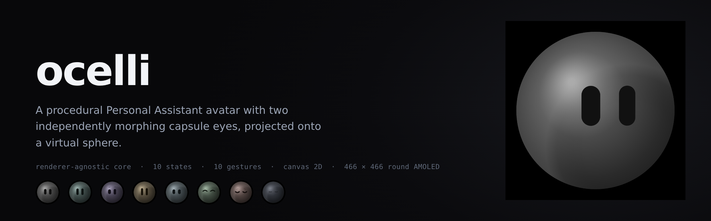
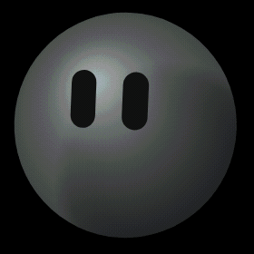
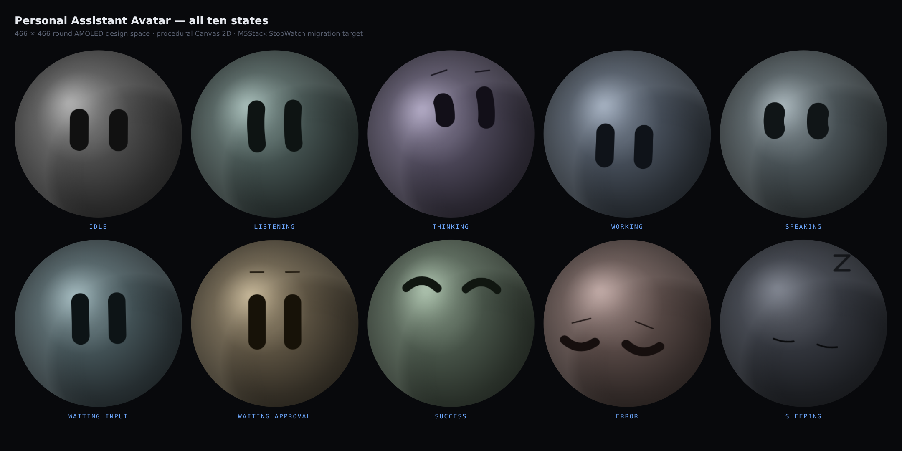
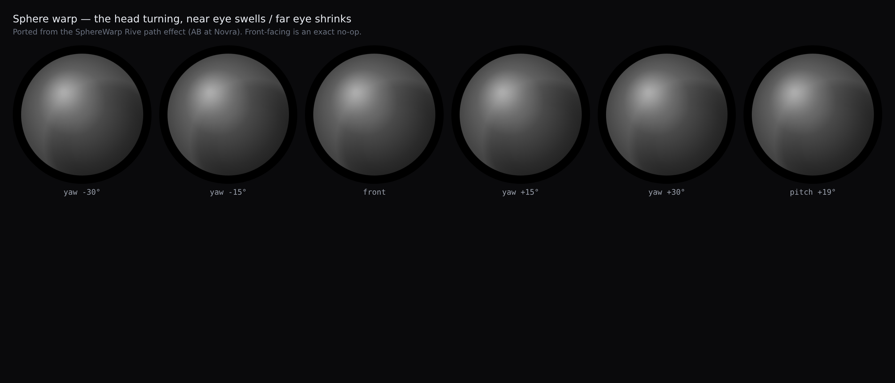
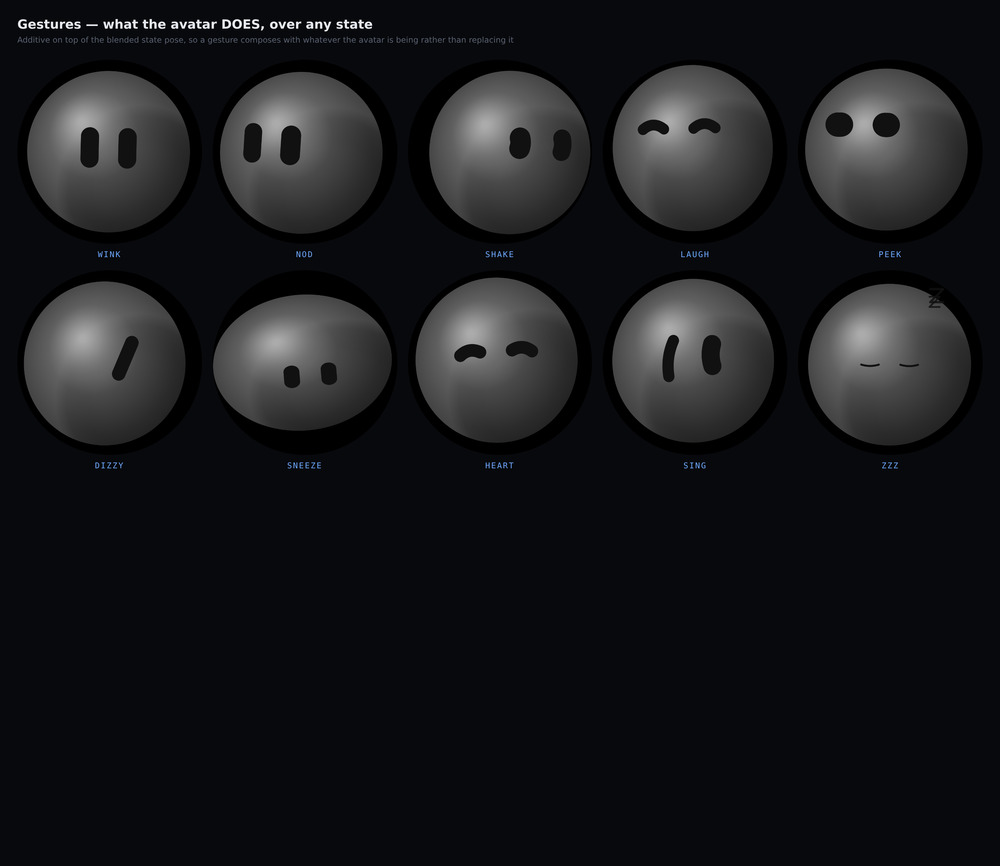

[](LICENSE)
[](#architecture)
[](#why-canvas-2d)
[](#verification)
[](docs/MIGRATION.md)

**ocelli** *(plural of* ocellus*, Latin for "little eye")* — the simple eyes of
insects and other arthropods. Two small eyes on a body with no other facial
features is exactly this avatar's design, so the name describes the thing rather
than decorating it.

A **Personal Assistant Avatar Engine** plus the **Web Avatar Lab** it is tuned
in: a procedural 2D character that runs in the browser today and is built to run
on an M5Stack StopWatch (466 × 466 round AMOLED) tomorrow.

**No GIFs, no video, no sprite sheets. Every frame is computed.**



*A full assistant turn — idle → listening → thinking → working → speaking →
approval → success, with a wink on the way out.*

---

## Quick start

```bash
npm install

# Standalone lab page (fastest iteration loop)
npm run dev            # http://127.0.0.1:5199/avatar-lab.html

# Production build + preview
npm run build && npm run preview

# Typecheck
npm run typecheck
```

### Inside the Harness Web GUI

The Lab also mounts into the DSH GUI as a client plugin, via a floating launcher
(a *live miniature avatar*) in the bottom-right and a full-screen overlay.

```bash
npm run build:plugin
dsh plugin --profile web add link:$PWD/dist/plugin
# restart `dsh web` once so the profile layer is picked up
```

After the restart the launcher appears in the GUI, and the plugin is served from
the DSH module roster. `Esc` or the ✕ closes the overlay.

---

## What it looks like

A **matte grey ball** on a black round screen, carrying **two flat black
capsule eyes**. No mouth, no nose, no ring, no trail, no particles, no text, no
logo — two shapes and a gradient, which is the whole avatar.

Black eyes on grey were chosen for contrast, not for mood: it is the highest
figure-ground difference available at any size, and it keeps the face legible
down to the 64 px miniature in the GUI launcher. Per-state palettes vary the
grey's *temperature and lightness* rather than its hue, so no state ever reads
as an alarm; mood is carried by the eyes' shape and the head's motion.

```
        ╭────────────────────╮
        │   ╭────────────╮   │
        │  │   ▮     ▮   │   │   eyes: capsules that morph
        │  │    sphere   │   │   body: shaded, never outlined
        │   ╰────────────╯   │
        ╰────────────────────╯
```

Four rules, enforced in the renderer, are what keep it from becoming a cartoon:

1. **The sphere is shaded, never outlined.** A soft radial gradient lit from the
   upper-left gives volume; a small specular and a far-side rim light finish it.
   There is deliberately no stroke. An outline turns a sphere into a badge, and
   the reference hardware has no circle drawn on it at all. Edge falloff mixes
   toward **black, not toward the background colour** — mixing a blue into a
   warm near-black desaturates it into slate-brown, which is a mistake that was
   made and corrected.
2. **The eyes are capsules that morph AND arc.** Each eye runs along its own
   long axis — vertical when tall, horizontal when flattened — and its
   centreline BOWS perpendicular to that axis via `eyeBow`.

   **The cap share is what decides whether an eye reads as a capsule.** A
   capsule's two round caps consume exactly its *width* of its total length, so
   the straight run — the part that reads as a line — is only
   `1 - width/length` of the shape:

   | | aspect | caps | reads as |
   |---|---|---|---|
   | 40 × 100 | 2.50 | **40%** of the length | a stubby pill |
   | 36 × 125 | 3.47 | **29%** of the length | a capsule |

   Matching the reference's *aspect* while ignoring the cap share produced an
   eye that measured correctly and looked visibly too short. Both numbers have
   to be right.

   * `+1` arcs upward — the `^ ^` grinning eyes every emoji uses
   * `-1` sags downward — the `v v` wince
   * `0` stays straight

   `eyeBow` is the channel that makes SUCCESS read as *delighted* rather than
   merely squinting, and it is why ERROR and SUCCESS are mirror images.

   The axis is decided by the state's `round` value, **never** by the
   post-projection pixel dimensions: a turned head squeezes an eye's width, so
   comparing drawn width against drawn height let a capsule flip axis mid-turn
   and render as a smeared blob.

   The capsule is drawn as a **stroked polyline with round caps and joins**,
   which is exactly the Minkowski sum of the centreline with a disc — a
   mathematically perfect capsule at any curvature, with the rasteriser doing
   the union so there is no winding rule to get wrong. Three earlier attempts built it as a path — a filled polygon,
   a stroked arc, and a crescent between concentric arcs — and each produced a
   different artifact (a notch, a cloud, a donut, a wedge): a variable-width
   band around a tight curve needs correct winding, and the winding flips as
   curvature passes through the stroke radius. Stamping has no winding rule to
   get wrong, gives perfect round caps at any curvature, and ports to C++ as a
   plain loop. The stroke also **thins as it bows** (to ~22% at full bow),
   because a thick capsule's caps bulge further than a shallow arc rises and
   the curve stops reading as a curve.
3. **The two eyes are INDEPENDENT.** `eyeRoundL/R`, `eyeSizeL/R`, `eyeLiftL/R`
   and `eyeTiltL/R` are separate channels. A symmetric change is a *mood*; an
   asymmetric one is a *thought* — which is why THINKING gives one capsule a
   different aspect from the other. This is where nearly all of the personality
   lives.
4. **Brows are opt-in.** Hidden at rest (`browOpen = 0`). Only THINKING (one
   raised), WAITING_APPROVAL (both raised evenly — a question, not a frown) and
   ERROR (both inner ends pinched up — distress) draw them. A permanent brow
   changes the character's whole face.

### Why Canvas 2D

Not **SVG**: the body deforms from a polar-radius function every frame, which in
SVG means rewriting a `d` attribute (string parse + layout) sixty times a second,
and every layer needs a per-frame gradient.

Not **WebGL / Three.js**: this is a 2D character with two shapes and a gradient.
A 3D engine would add a dependency, a shader build step, and a much harder
StopWatch port for zero visual gain. The sphere is an *illusion* produced by a
2D projection — it does not need a GPU.

Canvas 2D is also the closest thing to what the device has. The StopWatch
renderer is M5GFX drawing into a sprite; the primitives map almost one-to-one.

### The sphere warp — a face painted on a ball

The eyes are not drawn on a flat disc. They are projected onto a virtual ball,
which is what makes a head turn read as a *turn*:

- the eyes travel on a **curved** path, not a straight slide
- the eye coming toward you **swells**; the one turning away **shrinks**
- an eye near the limb **compresses**

That set of cues is what sells rotation, and doing it by hand means keying every
eye pose separately. Here it comes from two numbers: `headYaw` and `headPitch`.

**Ported from SphereWarp — a Rive path effect by AB at Novra, shipped with this
project as a reference and released by its author as free to use.**
The original is a Rive/Luau script; `core/sphere.ts` is the same projection
re-expressed as pure TypeScript so the engine, the Lab and a future C++ renderer
all share it. Two of its properties are preserved deliberately:

1. **It never bends the artwork.** Each eye moves as ONE PIECE — a capsule stays
   a capsule. Only its position, scale and depth change.
2. **Front-facing is an exact no-op.** At yaw = pitch = 0 the output equals the
   input for any pose, so the whole system degrades to the flat renderer.

Verified behaviour (see the suite): at yaw ±30° the near eye is **1.28×** the far
one, the two directions mirror exactly, and at yaw 0 the scales are identical to
within floating-point error.

The head turn is driven by a **second-order follower** rather than a copy of the
gaze — ported from the companion "delayed follow" spring in the same reference.
The head chases where the eyes are looking with `lag = 0.25 s` and
`bounce = 0.2`, integrated in fixed 1/240 s slices so the feel is identical at
30, 60 or 120 fps. Copying the gaze exactly makes the head feel welded to the
eyes; the lag is what makes it read as a head being *turned* by attention.

### The expression vocabulary

Every expression is one combination of these, and each was chosen for the
*specific feature that reads as that emotion*:

| | shape | arc | brows |
|---|---|---|---|
| IDLE | tall-ish | straight | — |
| LISTENING | tall | faint lift | — |
| THINKING | **asymmetric** (one narrow) | slight sag | one raised |
| WORKING | tall, symmetric | straight | — |
| SPEAKING | round | light lift, answers the voice | — |
| WAITING_INPUT | tall | straight | — |
| WAITING_APPROVAL | tallest | straight | **both up, even** |
| **SUCCESS** | wide | **`^ ^` arc up** | — |
| **ERROR** | wide | **`v v` sag down** | **both pinched up** |
| SLEEPING | closed to lines | gentle sag | — |

The eyes are also **projected onto the sphere**: the further a capsule sits from
centre, the more its width foreshortens, so they read as marks on a curved
surface rather than stickers on a flat disc.

## The ten states



Each state is a still photograph from the same renderer. Read the eyes: the
capsules change aspect, the arc flips from `^ ^` to `v v`, and the brows appear
only where the eyes alone cannot carry the meaning.

| State | Feel | Signature |
|---|---|---|
| `idle` | *I'm here.* | Slow breathing, faint interior light drift, rare blinks. Eyes glance around every 0.8-2.6 s. No brows. |
| `listening` | *I'm listening to you.* | Taller capsules, closer together, answering your voice with a shallow pulse. No brows. |
| `thinking` | *I'm reasoning.* | **One capsule narrower and smaller than the other**, one brow raised. The asymmetry is the whole read. |
| `working` | *I've started doing it.* | Level, symmetric, purposeful — the asymmetry collapses, which is what "decided, executing" looks like. |
| `speaking` | *I'm talking to you.* | Lower-wave deformation from a quantised amplitude envelope. |
| `waiting_input` | *I'm waiting for you.* | Tall, calm, evenly spaced, still. No brows. |
| `waiting_approval` | *I need your decision.* | **Tallest capsules, BOTH brows raised evenly** — a question, never a frown. Contract → pause → expand heartbeat. |
| `success` | *Done — that went well.* | **Both capsules flatten and lift into a happy squint**, then melt back to idle. No brows. |
| `error` | *That didn't work.* | Capsules drop, **both brows pinch up into distress**, a brief instability burst, then a stable subdued pose. |
| `sleeping` | *I'm resting, but I'm still here.* | Capsules close to thin lines and drift down; motion nearly stops. One faint breath every 9 s. |

`THINKING` and `WORKING` are deliberately kept apart (isotropic churn vs.
directional motion) and the test suite asserts they differ by a measured pixel
delta — as it does for `WAITING_INPUT` vs `WAITING_APPROVAL`.

---

## Touch interaction

The StopWatch is a **touch device with two buttons, a vibration motor and an IMU**,
so touch is the primary way a person talks to the avatar. The recogniser lives in
`core/interaction.ts` — pure logic over positions, with **no clock and no DOM** —
so the C++ port feeds it CST820B touch events and gets identical behaviour.

| Gesture | What it does |
|---|---|
| **Point** | The avatar looks at your finger, wherever it is |
| **Drag the ball** | **Turns the head, following your finger on both axes.** Horizontal drag yaws, vertical pitches. This is direct manipulation: the sphere projection swings the eyes around the ball as you turn, and releasing hands the head back to the gaze with a spring |
| **Tap** | Blink — or wake it, if it was asleep |
| **Double tap** | Wink |
| **Long press** | Toggle sleep |
| **Swipe ← →** | A deliberate glance in that direction |
| **Swipe ↑ ↓** | Nudge activity up / down |

Drag-to-turn is the interaction the sphere warp was built for. Because the head
follows the finger with a **stiffer spring while dragging** (`lag 0.11 s` instead
of `0.25 s`), it tracks the finger rather than trailing it, and the eyes ride
around the ball as it turns — the near one swelling, the far one shrinking.

The engine **owns the clock**: the host supplies event *order* only, and all
gesture timing derives from the accumulated `step(dt)` deltas. That is what makes
a long press last the same wall-clock time at 30 fps and at 120 fps, and it is
why the recogniser needs no time source when it is ported.

The two axes need opposite sign handling, which is worth recording because it
is not obvious: screen coordinates grow **downward** while the projection is a
standard 3D one where positive pitch tips the face **up**. A raw `+dragDY`
therefore tipped the head the wrong way, and the fix is a negation in
`dragToTurn`. Yaw needs no correction — dragging right already turns the face
right — which is exactly why the bug presented as "only sometimes reversed".

Swipe and drag are separated by **duration and speed, not distance**: a fast
flick that travels far is a swipe, a slow drag over the same distance is a head
turn, and the same press can legitimately be both — reported as a drag while held
and resolved as a swipe on release.

## Gestures — what it *does*, vs. what it *is*

A **state** is something the avatar *is*. A **gesture** is something it *does*.
Keeping them apart is what stops the state machine growing a case for every new
trick: a gesture plays *over* any state, and adding one cannot break the others.

| Gesture | What it does |
|---|---|
| **Wink** | One capsule closes and reopens — fast shut, slower open with a small overshoot |
| **Nod** | Agreement: the head dips and the eyes travel with it |
| **Shake** | Disagreement: two and a half head rotations, eyes lagging opposite |
| **Laugh** | Rapid squint/release bouncing, body bouncing in sympathy |
| **Peek** | A quick glance aside and back — reads as curiosity |
| **Dizzy** | The two capsules rotate in **opposite** directions — legible as spinning with no swirl graphics |
| **Sneeze** | Compress and shut, then release with a recoil. The wind-up is what sells it |
| **Heart** | Capsules soften into wide low arcs with a slow swell — no hearts drawn |
| **Sing** | *Sustained.* The capsules bounce **alternately**, like notes |
| **Zzz** | *Sustained.* Floating "Z" glyphs rise from the sphere while asleep |

```ts
engine.gesture('wink');       // play by name
engine.gesture('peek', -1);   // lateral gestures take a side
engine.gesture('sing');       // sustained; stop with engine.gestures.stop()
```

Two gestures are automatic: **SUCCESS winks** on entry, and **SLEEPING starts the
Zzz glyphs** (and stops them on wake).

Gestures are **additive deltas** applied after the state pose has been blended,
so a nod composes with whatever the state is doing instead of replacing it. Each
gesture is a pure function of normalised progress, which keeps the controller
branch-free and makes the whole table a straightforward C++ port.

The **Z glyphs are drawn by the renderer**, not the engine: the engine publishes
only an intensity (`signals.gestureZzz`) and stays free of fonts.

## Architecture

The single most important decision: **the animation engine has no idea it is
running in a browser.**

```
src/avatar/
├── core/                     ← portable to C++ (≈2 700 lines)
│   ├── state.ts              AssistantState + the priority ladder
│   ├── interaction.ts        ★ touch: tap/double/long-press/swipe/drag
│   ├── params.ts             AvatarInput / AvatarPose / AvatarSignals
│   ├── easing.ts             named closed-form easings (no bezier solver)
│   ├── timeline.ts           Clock, Deadline, Rng, Track
│   ├── transitions.ts        Spring, PoseBlender, Pulse, Envelope
│   ├── states.ts             ★ the identity: state → target pose + modulation
│   ├── behavior.ts           ★ AvatarEngine — the frame pipeline
│   └── scenario.ts           declarative demo timelines + runner
│
├── behaviors/                ← portable to C++ (≈1 400 lines)
│   ├── gestures.ts           ★ 10 gestures, additive over any state
│   ├── body.ts               ★ whole-body springs: lean, drift, squash, hops
│   ├── blink.ts              230 ms blink, 6–20 s cadence, 20% double
│   ├── gaze.ts               ★ GazeSource seam (pointer now, BMI270 later)
│   ├── speaking.ts           AURA's mouth envelope, ported verbatim
│   └── ambient.ts            rare micro-reactions + continuous drift
│
├── renderer/web/             ← REWRITTEN for the device (≈1 100 lines)
│   ├── canvasRenderer.ts     ★ the only module that knows about pixels
│   └── palette.ts            per-state material system
│
└── components/               ← Web only (React)
    ├── AssistantAvatar.tsx   canvas host + rAF loop (zero animation logic)
    ├── DeviceFrame.tsx       the 466 × 466 round bezel
    └── AvatarLab.tsx         the lab UI
```

### The frame pipeline

```
AvatarInput ──spring──▶ smoothed inputs
                          │
              ┌───────────┼───────────┬────────────┐
              ▼           ▼           ▼            ▼
          Blink       Gaze       Ambient      Mouth/Listen
              └───────────┴───────────┴────────────┘
                          │  AvatarSignals
                          ▼
       STATE_SPECS[state].pose  ──▶ blend target (state changes ONLY)
                          │
                    PoseBlender (eased crossfade)
                          │
                 + modulate() + blink + gaze + body springs
                          ▼
                      AvatarPose ──▶ renderer
```

Three properties make the port mechanical:

- **No time source inside the core** — `step(dt)` takes a delta; the caller owns
  time.
- **No output units inside the core** — `AvatarPose` is unitless; the renderer
  owns pixels and colour.
- **No allocation in the frame path** — fixed pools and flat structs, which the
  Web wants for GC and the MCU needs outright.

### The `GazeSource` seam

```ts
interface GazeSource {
  readonly kind: string;
  read(): { x: number; y: number };
}
```

`PointerGazeSource` (mouse) is the Lab's. The device swaps in an `ImuGazeSource`
over the BMI270 and **nothing else changes** — the dead-zone, the spring
inertia and the attention-based centre bias all carry over. This interface is
the reason the brief's "mouse → IMU" requirement costs one class, not a refactor.

---

## The Lab

- **State buttons** — all ten, switchable by hand
- **Continuous sliders** — Attention, Activity, Urgency, Audio Level, Look X, Look Y
- **Auto Demo** — `idle → listening → thinking → working → speaking → success → idle`
- **Run Assistant Demo** — the full end-to-end story:

  > Idle → *"Check if my professor replied to my email."* → Listening → Thinking
  > → Working *Reading Gmail…* → **Waiting Approval** *"Reply to Professor Xu?"*
  > → Approve → Working *Sending…* → Success → Idle

- **Gestures** — ten of them, on their own buttons: Wink, Nod, Shake, Laugh,
  Peek, Dizzy, Sneeze, Heart, Sing, Zzz
- **Touch controls** — drag-turn range and long-press duration are live sliders,
  and the last recognised input is displayed so the vocabulary is observable
- **Behaviour tests** — force a Blink / Glance / Micro-reaction / Pulse in isolation
- **Live pose readout** — every `AvatarPose` field grouped by eye shape, eye
  placement, brows, body motion and sphere, so you can see *why* a state looks
  the way it does
- **Click the avatar** to blink; click it while asleep to wake it
- **Move the pointer** to look around

---

## Verification

Two real-browser suites (Playwright + headless Chromium), not unit tests — they
drive the actual page and measure pixels.

```bash
node tools/verify.mjs         http://127.0.0.1:5199/avatar-lab.html verification
node tools/verify-harness.mjs http://127.0.0.1:3099/                verification-harness
node tools/contact-sheet.mjs   # the ten-state grid
node tools/banner.mjs          # the header image
node tools/demo-gif.mjs        # docs/demo.gif
node tools/direction.mjs       # drag axes, measured on the canvas
```

The harness probes for a Chromium binary rather than assuming one; override with
`AVATAR_LAB_CHROMIUM=/path/to/chrome` if needed.

| Suite | Result | What it proves |
|---|---|---|
| Standalone page | **66 / 66** | boots clean · 466 × 466 true circle · renders · **no ring/trail/particles outside the sphere** · all 10 states selectable · all 45 state pairs visually distinct · **eyes travel ~96 px horizontally and ~92 px vertically with no input** · THINKING looks up, ERROR down, SUCCESS up · **SUCCESS flattens the capsules, THINKING makes them asymmetric, SLEEPING closes them** · **IDLE/SUCCESS show no brows, THINKING/APPROVAL/ERROR do** · ERROR raises both brows inward · blink works · **WINK closes exactly one eye** · NOD moves the head · LAUGH/HEART reshape the capsules · SING never balloons them · **ZZZ emits glyphs and SLEEPING starts them automatically** · **SUCCESS arcs up (^ ^) and ERROR arcs down (v v) — asserted opposite** · **sphere warp is a no-op facing forward, swells one eye and shrinks the other, and mirrors exactly** · **LAUGH and HEART arc upward** · **all touch interactions, including that DRAG RIGHT/DOWN actually moves the face that way: drag turns the head symmetrically and springs back, tap blinks, double-tap winks, long-press sleeps, tap wakes, swipes are recognised, and a slow drag is NOT a swipe** · scenario plays the exact expected sequence |
| Inside the DSH GUI | **25 / 25** | plugin mounts · launcher live and animating · **existing Harness UI untouched** · overlay stays click-through · 466 × 466 frame inside the GUI · all 10 states · scenario reaches APPROVAL and SUCCESS · closes cleanly |

Screenshots are written next to each `report.json`. The grids in `docs/` are
produced by `node tools/contact-sheet.mjs`, `tools/demo-gif.mjs` and
`tools/banner.mjs` — every image in this README is generated from the real
renderer, so none of them can drift from the product.

---

## More views

<table>
<tr>
<td width="50%"><br>
<sub><b>Sphere warp.</b> A head turn moves the eyes on a curve, swells the near
one and shrinks the far one. Front-facing is an exact no-op.</sub></td>
<td width="50%"><br>
<sub><b>Ten gestures.</b> Layered additively over any state, so a nod composes
with whatever the avatar is being rather than replacing it.</sub></td>
</tr>
</table>

---

## Reference projects

Fusion, stated precisely — see [`docs/ANALYSIS.md`](docs/ANALYSIS.md) for the
full analysis:

| Contribution | Source |
|---|---|
| Easing vocabulary, crossfade transitions, procedural idle tuning, renderer discipline for a small MCU | **KK** (AGPL-3.0 — ideas only, no code copied) |
| Controlled expression API; the *principle* of a continuously morphing expression surface | **Grok Bot Orb** (MIT — no paths, colours or proportions used) |
| State priority ladder, blink model, gesture table, mouth envelope, asymmetric attack/release, synthetic energy floor | **AURA** (MIT) |
| Sphere shading, capsule eyes, independent per-eye channels, conditional brows, palette | **Original** |
| Sphere projection (yaw/pitch warp) and the delayed-follow head spring | **SphereWarp + DelayedFollow, AB at Novra** (supplied as reference; author states free to use) |

`docs/MIGRATION.md` records what transfers to the StopWatch, what must be
rewritten, and the evidence level of every claim.

---

## Licence

MIT. See `docs/MIGRATION.md` §7 for the reference-project boundary.
